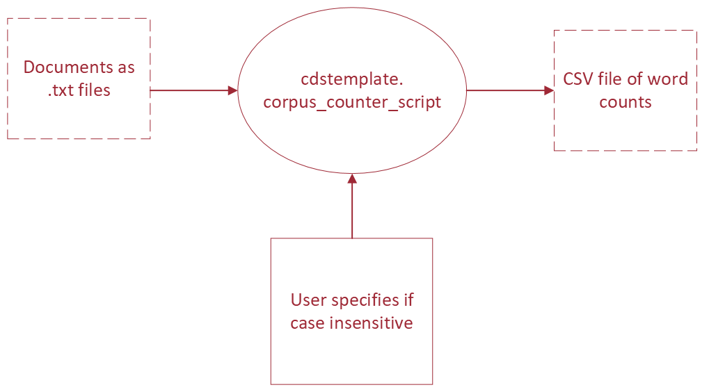

# iNaturalist GeoModel Annotator Project

Code repository for 2024 Data Science for the Common Good project with iNaturalist. 

Collaborators: Angela Zhu, Paula Navarrete, Sergei Pogorelov, Ozzie 

This template draws a lot of inspiration from [Cookiecutter Data Science](https://drivendata.github.io/cookiecutter-data-science/). Please read their awesome explanations!

# Getting Started
## :hatched_chick: Installation for local development
Make sure you update your local branch to the latest.

```
$ conda create -n inatator python=3.9
$ conda activate inatator
```

### React Components
1) Navigate to `src/frontend`
2) Run `npm i` that will install js libraries needed for react.

### Backend and SINR Dependency Installation
1. Check if you have `poetry`, this is needed because poetry is a tool that finds all compatible library versions while downloading them, otherwise we would die
  - To install poetry go to https://python-poetry.org/docs/
  - It will need you to install pipx, pip on steroids, follow the official pipx instructions to install
  - You don't have to run the command with --global option, the last command
  - Steps will differ slightly based on your OS
  - After pipx is installed you can install poetry from their instructions, just one line
2. Check poetry by just typing `poetry` into terminal, it should recognize and list options etc

3. Now at the project root you can run `poetry install` which will install all packages required for now
  - To double check everything is working as intended, navigate to `src/sinr/models.py` write a function that prints something. Now, navigate to `src/backend/app` and create a temporary python file that you will delete later, in the file enter `from sinr.models import *`, then call the function you just created from that file, make sure it prints correctly and does not give errors.

## :penguin: Run the Application
Open two terminals. You will need to run the server first, then application frontend.
1. ***Run the backend (server):*** To start the server, navigate to project root, run `uvicorn src.backend.app.main:app --reload`, to make sure it is working go to `http://localhost:8000/hello/` in your browser.
2. ***Run the frontend (application):*** To start the application, navigate to `src/frontend/` you see there are js things, you are at the right spot. Now run `npm start`, it will start running the app and should automatically open to page in your browser.

### Running applications with Docker
1. Install Docker if you haven't already
2. Navigate project root
3. Run `docker compose up --build`
  - For the first build it may take a while
4. Make sure the default application is running as expected by going to urls for react and server
5. During development, you can stop contianers with ctrl+c or using the Docker app
6. If you want to start the application again, run `docker compose up`
7. If you change a docker configuration file, run `docker compose up --build`

## Code Standards
1. Use Docstrings, for some functions just a one-linet is fine, but for more complicated functions include multi-line documentation that explains the function simply, has information about arguments, and has details about the output.
2. Module Docstrings, include a short description of module and functions inside the module.
3. Use a formatter if possible, **black** formatter has support for vscode and is decent

# Communication Tools and Code
When you work with others, it's not just about the code!

The README, CHANGELOG and docstrings are just as important.

- _README.md_ : Summarize the project's purpose and give installation instructions.
- _CHANGELOG.md_ : Tell the user what has changed between versions and why, see [Keep A CHANGELOG](https://keepachangelog.com/en/1.0.0/)
- docstrings: Appear directly in your code and give an overview of each function or object. They can be printed using `help(object)` from the python interpreter or used to automatically generate API documentation with a tool like [Sphinx](https://www.sphinx-doc.org/en/master/index.html). There are many different docstring formats. Your team can choose any they like, just be consistent. This template uses [reStructuredText style](https://peps.python.org/pep-0287/).
- Sphinx  : Create html documentation for your functions based on the docstrings you write in the code. Use [Sphinx](https://www.sphinx-doc.org/en/master/index.html) to streamline the documentation process.

Read [Real Python's Documenting Python Code: A Complete Guide](https://realpython.com/documenting-python-code/) for more ideas about effectively documenting code. The `.md` files are written using [Markdown](https://www.markdownguide.org/), a handy formatting language that is automatically rendered in Github.

# Tests

Although it's [impossible to generally prove that your code is bug-free](https://en.wikipedia.org/wiki/Undecidable_problem), automated testing is a valuable tool. It provides:
- Proof that your code works as intended in most common examples and important edge cases
- Instant feedback on whether changes to the code broke its functionality
- Examples of how to use the code, a type of documentation

This repository has tests configured using [pytest](https://pytest.org/) and the Github action defined in `.github/workflows/python_package.yml` will run tests every time you make a pull request to the main branch of the repository. [Unittest](https://docs.python.org/3/library/unittest.html#module-unittest) and [nose2](https://docs.nose2.io/en/latest/) are other common test frameworks for python.

You can run tests locally using `pytest` or `python -m pytest` from the command line from the root of the repository or configure them to be [run with a debugger in your IDE](https://code.visualstudio.com/docs/python/testing). For example:
```
$ pytest
======================== test session starts ========================
platform linux -- Python 3.10.4, pytest-7.1.2, pluggy-1.0.0
rootdir: /home/virginia/workspace/PythonProjectTemplate
collected 2 items

tests/test_sample_module.py .
```

Read the following articles for tips on writing your own tests:
- [Getting Started With Testing in Python](https://realpython.com/python-testing/)
- [13 Tips for Writing Useful Unit Tests](https://betterprogramming.pub/13-tips-for-writing-useful-unit-tests-ca20706b5368)
- [Why Good Developers Write Bad Unit Tests](https://mtlynch.io/good-developers-bad-tests)

# Reproducible Experiments
In practice, data science often relies on pipelining many operations together to prepare data, extract features, then train and evaluate models or produce analysis. Whether someone can reproduce your experiments depends on how clearly you lay out the pipeline and parameters that you use for each 'node' in the pipeline, including stating where to find the input data and how it should be formatted.

In practice, you should write scripts that are flexible enough to change the parameters you'd like to experiment with and define the pipeline using a directed acyclic graph (DAG), where the outputs from earlier steps become the dependencies for later ones. It's good practice to draw out the DAG for your experiment first, noting inputs, outputs and parameters, before you code scripts for the pipeline, like this:



## Reusable Scripts
Our 'experiment' here is simply counting the occurrence of words from a set of documents, in the form of text files, then writing the counts of each word to a CSV file. This operation is made available to users via the `cdstemplate.corpus_counter_script` and by using the [`argparse` command-line parsing library](https://docs.python.org/3/library/argparse.html#module-argparse), we clearly describe the expected input parameters and options, which can be displayed using the `--help` flag. There are [other command-line parsers](https://realpython.com/comparing-python-command-line-parsing-libraries-argparse-docopt-click/) you can use, but `argparse` comes with python, so you don't need to add an extra requirement.


Since we have made the package installable and defined it as the `corpus-counter` script in `project.toml`, users can run it using `corpus-counter`, `python -m cdstemplate.corpus_counter_script` or `python src/cdstemplate/corpus_counter_script.py`, but all work the same way:
```
$ corpus-counter --help 
usage: corpus-counter [-h] [--case-insensitive] csv documents [documents ...]

A script to generate counts of tokens in a corpus

positional arguments:
  csv                   Path to the output CSV storing token counts. Required.
  documents             Paths to at least one raw text document that make up the corpus. Required.

options:
  -h, --help            show this help message and exit
  --case-insensitive, -c
                        Default is to have case sensitive tokenization. Use this flag to make the token counting
                        case insensitive. Optional.
$ python src/cdstemplate/corpus_counter_script.py --help
usage: corpus_counter_script.py [-h] [--case-insensitive]
...
$ python -m cdstemplate.corpus_counter_script --help
usage: corpus_counter_script.py [-h] [--case-insensitive]
                                csv documents [documents ...]

A script to generate counts of tokens in a corpus
...
```

Using the help message, we can understand how to run the script to count all the words in the text files in `data/gutenberg` in a case-insensitive way, saving word counts to a new csv file, `data/gutenberg_counts.csv`:
```
$ corpus-counter data/gutenberg_counts.csv data/gutenberg/*.txt --case-insensitive
INFO : 2023-12-08 12:26:10,770 : cdstemplate.corpus_counter_script : Command line arguments: Namespace(csv='data/gutenberg_counts.csv', documents=['data/gutenberg/austen-emma.txt', 'data/gutenberg/austen-persuasion.txt', 'data/gutenberg/austen-sense.txt', 'data/gutenberg/bible-kjv.txt', 'data/gutenberg/blake-poems.txt', 'data/gutenberg/bryant-stories.txt', 'data/gutenberg/burgess-busterbrown.txt', 'data/gutenberg/carroll-alice.txt', 'data/gutenberg/chesterton-ball.txt', 'data/gutenberg/chesterton-brown.txt', 'data/gutenberg/chesterton-thursday.txt'], case_insensitive=True)
DEBUG : 2023-12-08 12:26:10,771 : cdstemplate.word_count : CorpusCounter instantiated, tokenization pattern: \s, case insensitive: True
INFO : 2023-12-08 12:26:10,771 : cdstemplate.corpus_counter_script : Tokenizing document number 0: data/gutenberg/austen-emma.txt
DEBUG : 2023-12-08 12:26:10,771 : cdstemplate.word_count : Tokenizing '[Emma by Jane Austen 1816]
...
```

## Data Dependencies Tools
[Build automation tools](https://en.wikipedia.org/wiki/Build_automation) like [Make](https://en.wikipedia.org/wiki/Make_(software)) have been used to resolve dependencies and compile software since the 1970s. Build automation can also be used in data science and machine learning workflows for [many of the same reasons](https://en.wikipedia.org/wiki/Build_automation#Advantages), like eliminating redundant tasks, maintaining history and improved quality and consistency through automating processes. Using a build tool can also be a documentation and communication tool, since it declares the most common ways to run code and reproduce experiments.

In the Machine Learning Operations (MLOps) community these automation tools are often called [task or workflow orchestration](https://www.datarevenue.com/en-blog/airflow-vs-luigi-vs-argo-vs-mlflow-vs-kubeflow). There are many options, such as [Airflow](https://airflow.apache.org/), [Luigi](https://github.com/spotify/luigi), [MLflow](https://mlflow.org/), [Kubeflow](https://www.kubeflow.org/) and [iterative.ai's DVC and CML](https://iterative.ai/), all with various additional features for versioning experiments, scheduling and visualizations, but at the core they are all built on the same dependency graph principle as the OG [Make](https://opensource.com/article/18/8/what-how-makefile).

Some of these tools can take a lot of work to set up, so discuss the trade-offs with your team to decide what you'd like to use. In the early stages of a project, we recommend using something easy to set up, like [DVC](https://dvc.org/) or [Make](https://opensource.com/article/18/8/what-how-makefile).

### DVC Example
In this repository, we have set up a pipeline using [DVC](https://dvc.org/), which has the added benefit of versioning data and experiments. DVC is especially easy to set up for Python projects, because it can be installed via pip in the project requirements and integrates with git. See [DVC Get Started documentation](https://dvc.org/doc/start) for instructions on setting up DVC in your own repository.

The stages in our word count experiment pipeline are configured in `dvc.yaml`. As described in the previous section, this takes the `data/gutenberg` files as input and produces `data/gutenberg_counts.csv` as the final product. Since `data/gutenberg_counts.csv` should be generated whenever the data or scripts change, it is managed by DVC and ignored by git. You can re-run the pipeline steps by running `dvc repro`.
```
$ dvc repro
Running stage 'count-words':
> python cdstemplate/corpus_counter_script.py data/gutenberg_counts.csv data/gutenberg/*.txt --case-insensitive
INFO : 2022-05-23 11:18:42,813 : __main__ : Command line arguments: Namespace(csv='data/gutenberg_counts.csv', documents=['data/gutenberg/austen-emma.txt', 'data/gutenberg/austen-persuasion.txt', 'data/gutenberg/austen-sense.txt', 'data/gutenberg/bible-kjv.txt', 'data/gutenberg/blake-poems.txt', 'data/gutenberg/bryant-stories.txt', 'data/gutenberg/burgess-busterbrown.txt', 'data/gutenberg/carroll-alice.txt', 'data/gutenberg/chesterton-ball.txt', 'data/gutenberg/chesterton-brown.txt', 'data/gutenberg/chesterton-thursday.txt'], case_insensitive=True)
...
$ dvc repro
Stage 'count-words' didn't change, skipping
Data and pipelines are up to date.
```


You can see the stages in the DAG by running `dvc dag`, in our case it's just a single step called `count-words`:
```
$ dvc dag
+-------------+
| count-words |
+-------------+
```

## A Note on Notebooks
We have also included an example Jupyter notebook

Jupyter notebooks are useful tools for exploratory data analysis, prototyping baseline models and creating visualizations. However, they are _not_ an acceptable way to hand-off code for others to reproduce. Have you ever tried to run someone else's notebook, only to find out a cell was deleted, and you have no idea what it was supposed to do?

[Don't put data science notebooks into production](https://martinfowler.com/articles/productize-data-sci-notebooks.html), they are [hard to test, version, parametrize and keep track of state](https://www.reddit.com/r/datascience/comments/ezh50g/jupyter_notebooks_in_productionno_just_no/).

There _are_ [companies that use notebooks in production architecture](https://blog.goodaudience.com/inside-netflixs-notebook-driven-architecture-aedded32145e), but they have entire Devops organizations to help configure deployment and _still_ use workflow tools like [papermill](https://papermill.readthedocs.io/en/latest/) and Airflow to parametrize notebook dependencies. Unless you are willing to put in the effort to parametrize your notebooks in pipeline workflows, don't use them when stability and reproducibility matter.

Best practices for working with notebooks are changing as they become more popular. However, for now most of these services are too expensive for our partners or difficult to configure. You can use a notebook for prototyping and exploratory analysis, but once the project moves forward, use [`nbconvert`](https://linuxhint.com/convert-jupyter-notebook-python/) to convert the notebook to python code, then add some tests!
